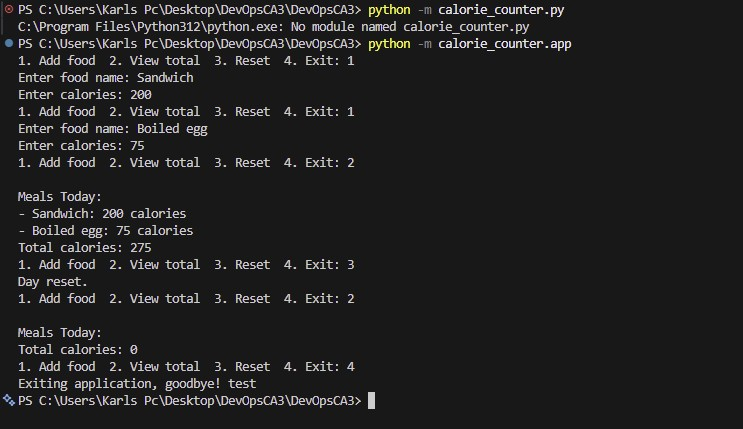
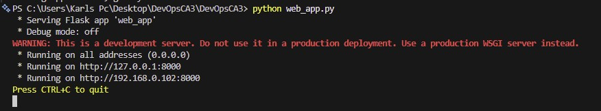
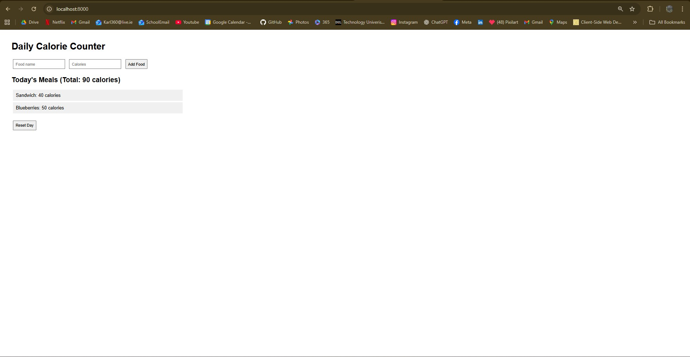
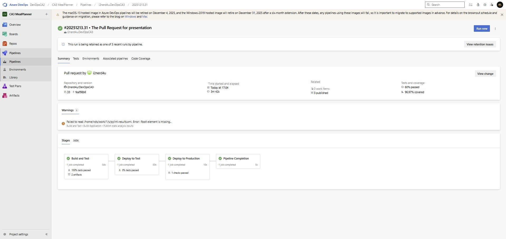
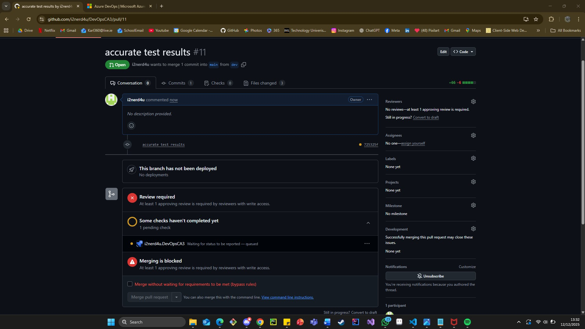
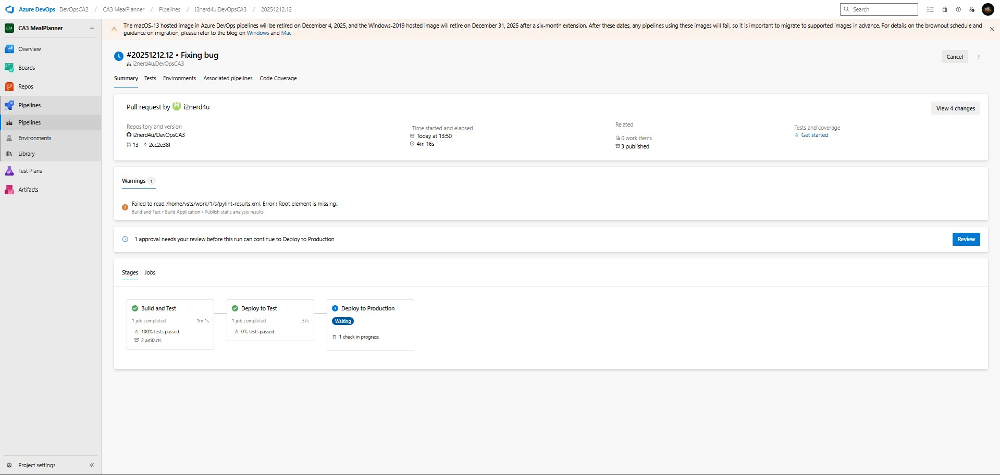
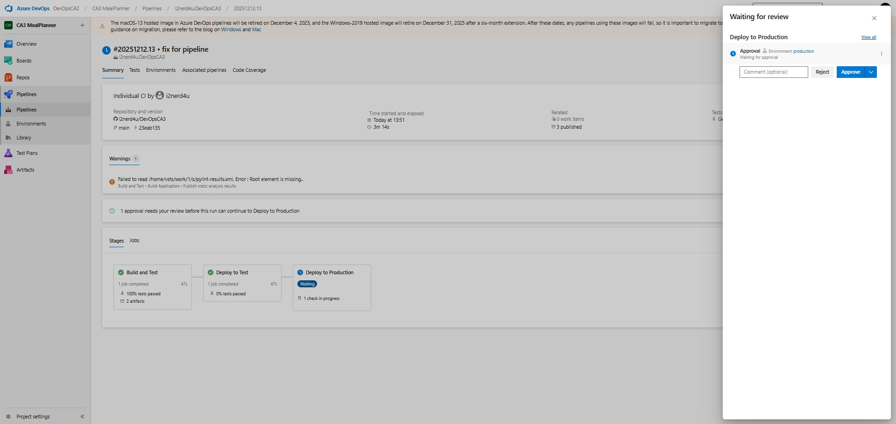
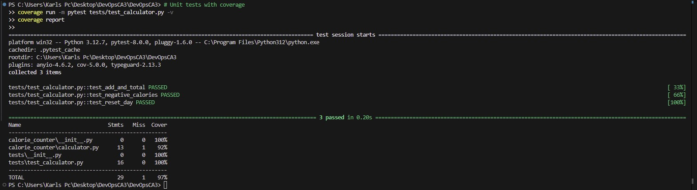
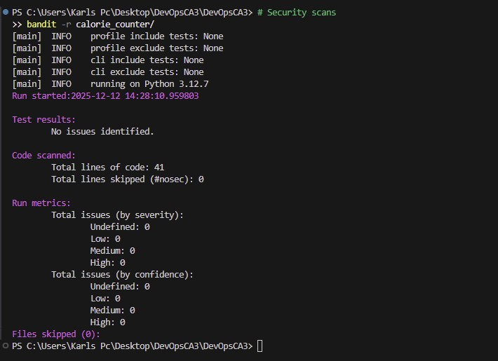
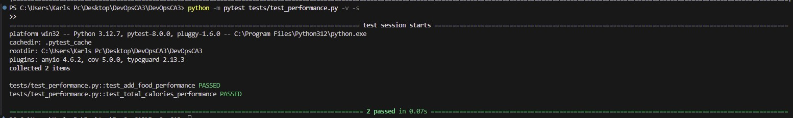

# Project Name = Calorie Counter CI/CD Pipeline

## Overview = 
Calorie Counter is a Python application with both CLI and web interfaces that allows users to input meals/food they have consumed and track daily calories. The program has 4 main options: 1- Add food, 2- View total, 3- Reset day, and 4- Exit. The focus of this CA3 project is to demonstrate advanced CI/CD practices with multi-stage pipelines, automated testing, security scanning, performance testing, UAT testing with Selenium, and multi-environment deployment with approval gates.

## Technologies Used - 
Python 3.12, Flask, GitHub, Azure DevOps Pipelines, pytest, Selenium WebDriver, Bandit (SAST), Safety (dependency scanning), pylint, coverage.py

## Local Development Setup
Clone the local Directory:
1- git clone https://github.com/YourUsername/X00189280_CA3.git
2- cd DevOpsCA3

Create a virtual Environment:
1- python -m venv .venv
2- .\.venv\Scripts\Activate

Install the required packages:
1- pip install -r requirements.txt

Run the CLI Application:
1- python -m calorie_counter.app

Run the Web Application:
1- python web_app.py
2- Access at http://localhost:8000

## Application Features:
Add Meal:
Input the name of the meal/food and its calories through CLI or web interface

View Total Calories:
Display the total calories consumed for the day with meal breakdown

Reset Day:
Clear all entered meals and reset the calorie count for a new day

Web Interface:
Flask-based web application for remote access and better user experience

## CI/CD Pipeline Implementation
The Azure pipeline is configured using the azure-pipeline.yml file with multi-stage deployment
The pipeline includes:
- **Build Stage**: Install dependencies, run all automated tests, enforce quality gates
- **Test Environment Stage**: Deploy to test environment, run UAT tests with Selenium
- **Production Stage**: Deploy to production with manual approval gates.

### Build Stage Features:
- Automatically running unit tests with pytest (95% coverage enforced - pipeline fails if below)
- Security testing with Bandit SAST and Safety dependency scanning
- Performance testing with load testing (1000+ items in <1 second)
- Static code analysis using Pylint
- Comprehensive test result publishing with JUnit XML reports
- Artifact creation and publishing for deployment stages

### Test Environment Features:
- Automated deployment of application artifacts
- Selenium WebDriver UAT testing (automated browser testing)
- End-to-end user workflow validation
- Health check validation

### Production Environment Features:
- Manual approval gate (deployment blocked until approved)
- Artifact-based deployment
- Production health verification
- Rollback capabilities

## Branch Policies and Protection
Branches:
- main (protected with enforced policies)
- dev (development branch for testing code before merging)

### Azure DevOps Branch Protection Rules (ENFORCED):
- **Pull Request Required**: Direct pushes to main branch are BLOCKED
- **Minimum Reviewers**: At least 1 approving review required before merging
- **Build Validation**: Pipeline must pass before merge is allowed - NO EXCEPTIONS
- **Up-to-date Requirement**: Branch must be current with main before merge
- **Quality Gates Enforced**: 
        - Coverage below 95% = Pipeline FAILS = Merge is BLOCKED
        - Any test failure = Pipeline FAILS = Merge is BLOCKED
        - Security scan failures = Pipeline FAILS = Merge is BLOCKED
        - Performance test failures = Pipeline FAILS = Merge is BLOCKED.

### Merge Methods:
- Merge commits allowed
- Squash merging allowed
- Rebase and merge allowed

## Testing Strategy
### Unit Testing:
- Adding meals functionality
- Calculating total calories for the day
- Resetting daily tracking
- Input validation and error handling
- **Coverage Enforcement**: Minimum 95% code coverage ENFORCED via Azure Pipelines
- Coverage measured using coverage.py with XML and HTML reports

### Security Testing:
- **Bandit SAST**: Static Application Security Testing for code vulnerabilities
- **Safety Scanning**: Dependency vulnerability scanning
- **Input Validation Tests**: XSS and SQL injection protection testing
- Security test failures BLOCK pipeline progression

### Performance Testing:
- Load testing with 1000+ food items
- Response time validation (<1 second requirement)
- Memory usage optimization testing
- Performance failures BLOCK pipeline progression

### UAT Testing with Selenium:
- Automated browser testing of web interface
- End-to-end user workflow validation
- Add food functionality testing
- Reset functionality testing
- Cross-browser compatibility testing

### Test Reporting and Analytics:
- **JUnit XML Reports**: Standardized test result format for all test types
- **Test Trend Analysis**: Historical test performance tracking in Azure DevOps
- **Coverage Reports**: Detailed HTML coverage reports with line-by-line analysis
- **Security Reports**: Comprehensive vulnerability reports stored as artifacts
- **Test Dashboard**: Integrated Azure DevOps test analytics and metrics

### Pipeline Integration :
- All tests automatically triggered on dev and also main branches 
- PRs cannot be merged unless ALL tests pass and coverage meets 95% coverage as a minimum
- Pipeline failures immediately block any merge attempts
- Test results published to Azure DevOps for tracking and analysis.

## Environment Setup and Configuration
### Test Environment:
- Automated deployment after successful build stage
- UAT test execution with Selenium
- Health check validation
- Application accessibility testing

### Production Environment:
- **Manual Approval Gate**: Deployment blocked until manual approval granted
- **Environment Protection**: Configured in Azure DevOps environments
- **Artifact-based Deployment**: Uses tested artifacts from build stage
- **Health Check Validation**: Post-deployment verification
- **Rollback Capabilities**: Ability to revert to previous version if issues detected

## Pipeline Approval Gates
### Code Quality Gates (ENFORCED - PIPELINE BLOCKING):
- **Coverage Gate**: Pipeline FAILS if coverage < 95%
- **Unit Test Gate**: Pipeline FAILS if any unit tests fail
- **Security Test Gate**: Pipeline FAILS if security tests fail  
- **Performance Gate**: Pipeline FAILS if performance tests fail
- **Static Analysis Gate**: Pylint analysis must pass

### Branch Protection Gates (ENFORCED - MERGE BLOCKING):
- **Pull Request Required**: Direct pushes to main BLOCKED
- **Reviewer Approval**: Minimum 1 reviewer approval required
- **Build Validation**: Pipeline must pass before merge allowed
- **Up-to-date Requirement**: Branch must be current with main

### Deployment Gates (MANUAL APPROVAL):
- **Test to Production**: Manual approval required for production deployment
- **Environment Protection**: Configured in Azure DevOps environments  
- **Branch Restriction**: Production deploys only from main branch

## Deployment Process
1. Code commit to dev branch triggers pipeline
2. **Build Stage**: All tests run, quality gates enforced, artifacts created
3. **Test Environment**: Automated deployment and UAT testing
4. **Production Approval**: Manual approval gate - deployment waits for approval
5. **Production Deployment**: Artifact deployment with health checks

## Troubleshooting Guide
### Coverage Failures:
- Ensure all code paths are tested (95% minimum ENFORCED)
- Check coverage report for missing lines: coverage report --show-missing
- Add tests for uncovered code before attempting merge

### Security Scan Failures:
- Review Bandit and Safety reports in pipeline artifacts
- Address identified vulnerabilities before merge
- Security failures BLOCK pipeline - no exceptions

### UAT Test Failures:
- Check Selenium WebDriver configuration and browser compatibility
- Verify web application is accessible during test execution
- Review UAT test logs for specific failure points

### Performance Test Failures:
- Verify application meets <1 second response time requirement
- Check load testing results for 1000+ item performance
- Optimize code if performance requirements not met

### Pipeline Failures:
- Check Azure DevOps pipeline logs for specific error messages
- Ensure Python 3.12 version consistency between local and Azure
- Verify all dependencies in requirements.txt are correctly specified
- Pipeline failures BLOCK merges - all issues must be resolved

### Branch Protection Issues:
- Cannot push directly to main - use Pull Requests only
- Ensure reviewer approval before attempting merge
- Pipeline must pass ALL quality gates before merge allowed
- Contact reviewer if approval needed for merge

### Deployment Issues:
- Verify environment configurations in Azure DevOps
- Check artifact availability and integrity
- Ensure manual approval granted for production deployments
- Review environment health checks and logs